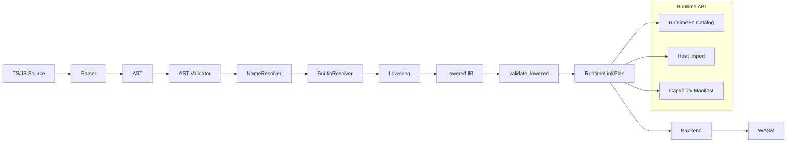

# Compiler architecture and runtime

この文書は compiler pipeline、IR、JS value representation、linear memory runtime、runtime ABI を扱う。

## コンパイラ構成

コンパイラは、frontend、semantic layer、lowering、runtime binding、wasm backend の五段階に分ける。

Crate boundary はこの pipeline に合わせる。`crates/frontend` は AST/span/diagnostic/token と lexer/parser 実装を持つ。`crates/compiler` は driver/orchestration を持ち、入力ファイル、dump phase、build option を frontend / IR / backend に流す。`crates/cli` は command parsing、path/stdout/stderr、exit code mapping だけを扱い、compiler 実装を持たない。

### Compiler Pipeline Visualization

Frontend は TypeScript / JavaScript の構文を読む。初期段階では既存 parser を oracle として使ってよいが、本体を Node.js の TypeScript compiler API に完全依存させる設計にはしない。`tsc` の parser / checker は比較対象、テスト oracle、差分検出のために利用する。プロダクションの変換器は、最終的には WASM に向いた IR を持つ独自 pipeline として成立させる。

Semantic layer では、TypeScript の型注釈、推論結果、制御フロー、スコープ、symbol、module 解決を扱う。TypeScript の型システムを完全再実装するのは重いが、型情報を無視すると最適化も診断も弱くなる。したがって、初期段階では型を「実行に必要な情報」と「診断に必要な情報」に分ける。実行に必要な情報は優先して compiler pipeline に取り込み、診断互換は段階的に強化する。

Lowering では、TypeScript / JavaScript の意味論を WASM に落としやすい IR に変換する。ここで重要になるのは、JavaScript の値表現、truthiness、`undefined`、`null`、number、string、object、array、function、closure、prototype、class、exception の扱いである。単純な型付き言語よりも runtime の責任が大きいため、IR には JS semantics を表現できる命令を持たせる。

WASM backend は、IR から `.wasm` を生成する。初期は linear memory ベースで実装し、iwasm で動くことを優先する。値表現は論理的な `jsval` を基本とし、初期 core wasm では `i64` tagged value、heap ref では 32-bit offset payload を使う。runtime heap に object / string / array / closure を置く。

WAT と wasm binary は同じ backend 契約を満たす等価な wire 表現として扱う。どちらを実装上の中間正本にしてもよいが、observable behavior、runtime ABI、manifest/import、WASI capability は一致しなければならない。WASI は標準入出力や filesystem などを wasm 側で処理するための前提 target であり、`fd_write` など WASI で表現できる API は原則 wasm/WASI 側で処理する。

wasm-tools は既に Wasm GC、reference-types、function-references、multi-memory、multi-value、SIMD、tail-call、threads などの提案を実装しており（多くは Stage 4+）、WAMR も multi-thread、AOT/JIT をサポートしている。将来的に Wasm GC backend を追加する場合も、IR は共有する。

## 値表現

TypeScript は実行時には JavaScript であるため、値表現は JS 値の多様性を扱える必要がある。`number`、`string`、`boolean`、`undefined`、`null`、`object`、`function`、`symbol`、`bigint` を同じ実行系で扱う必要がある。

初期実装では、すべての値を `JsValue` として扱う。`JsValue` は tagged representation にする。小さい整数や boolean、null、undefined は immediate value として表現し、string、object、array、function は heap object への handle として表現する。

| 値         | 表現方針                | 初期対応 |
| --------- | ------------------- | ---: |
| undefined | immediate tag       |   必須 |
| null      | immediate tag       |   必須 |
| boolean   | immediate tag       |   必須 |
| number    | immediate または boxed |   必須 |
| string    | heap object         |   必須 |
| object    | heap object         |   必須 |
| array     | heap object         |   必須 |
| function  | closure object      |   必須 |
| bigint    | heap object         | 段階対応 |
| symbol    | interned value      | 段階対応 |

BigInt は heap object representation を採用する。`RawValue` の low-bit tag は増やさず、object-tagged heap pointer の header kind で BigInt を判別する。literal allocation、arithmetic、comparison/coercion、builtin/string conversion は `docs/14-runtime-abi.md` の BigInt ABI boundary と issue 259-262 の実装 slice で段階的に導入する。

性能を考えると、すべてを boxed value にすると遅くなる。そのため、型情報と範囲解析が十分にある場合は fast path を生成する。たとえば TypeScript 上では `let x: number` と書かれた値でも、局所的に整数範囲であることを compiler が証明できる場合は、内部 IR では unboxed integer として扱える。ただし、ユーザーに `i32` のような AssemblyScript 由来の型注釈を書かせてはいけない。JavaScript の `number` は基本的に IEEE 754 double なので、TypeScript の型注釈だけで勝手に整数意味論に変えてはいけない。最適化は意味論を壊さない範囲で行う。

## メモリ管理

初期 runtime は linear memory 上に heap を実装する。GC は最初から完全な高性能 GC を作る必要はないが、object / string / array / closure を扱う以上、メモリ管理の設計は避けられない。

最初の実装では、単純な mark-and-sweep または arena + 明示 lifetime 管理に近い方式を採用する。CLI や短命プログラムでは arena 的な管理でも十分に動くが、長時間動くプログラムや Node host と連携するプログラムでは回収が必要になる。したがって、初期から heap object の header、type tag、mark bit、size、field layout を決めておく。

メモリ管理は後から差し替え可能にする。runtime の public interface が `alloc_string`、`alloc_object`、`get_prop`、`set_prop`、`call_function` のように整理されていれば、内部 GC の改善は compiler 全体に波及しにくい。

## 追加設計: runtime ABI

compiler と runtime の境界を曖昧にすると、lowering と emitter が密結合になる。最初に runtime ABI をテスト可能な形で固定する。

ABI 名は論理名であり、実際の export/import 名は `ts2wasm.rt.*` に正規化する。初期 core wasm backend では `jsval` を `i64` tagged value、`ptr` / `len` / `index` を `i32` として扱う。heap object は linear memory 内の 32-bit offset を payload として持つ。将来 Wasm GC backend を追加しても、compiler IR は同じ論理 ABI を呼び、backend が表現を差し替える。

> **Wire format と論理 ABI の差分**: `docs/14-runtime-abi.md` の RawValue はモジュール内で `i32` tagged encoding を使う small-int subset である。`docs/04` の論理 ABI で定義する `jsval`（`i64`）および `crates/shared/src/abi.rs` の `AbiType::JsVal` は import/export 境界向けの論理表現である。`crates/cli/src/runtime/value.rs` の `WasmTaggedJsWire` は wasm 本体の wire 表現を表す。backend は `i64` 論理 ABI と `i32` wire を暗黙に混在させてはならず、bridge が必要な場合は backend 層に明示し、テストで固定する。

| ABI type | wasm representation | 意味 |
|---|---|---|
| `jsval` | `i64` | JS 値。immediate tag または heap ref payload |
| `bool` | `i32` | `0` false、非0 true |
| `ptr` | `i32` | linear memory offset |
| `len` | `i32` | byte length または element count |
| `index` | `i32` | array/string index |
| `status` | `i32` | `0` success、非0 error/trap pending |

runtime helper は、通常の JS 例外を直接 wasm trap にしない。例外は runtime の pending exception slot に保存し、`status` または返却 `jsval` の error sentinel で compiler 側へ伝える。真の trap は out-of-bounds、ABI contract violation、runtime corruption のような復帰不能エラーに限定する。

### Value constructors

| Function | Signature | Notes |
|---|---|---|
| `make_undefined` | `() -> jsval` | singleton immediate |
| `make_null` | `() -> jsval` | singleton immediate |
| `make_bool` | `(bool) -> jsval` | boolean immediate |
| `make_number` | `(f64) -> jsval` | `NaN`、`-0` を保持する |
| `make_string_utf8` | `(ptr, len) -> jsval` | UTF-8 bytes を runtime string にコピー |

### Conversion and comparison

| Function | Signature | Notes |
|---|---|---|
| `to_boolean` | `(jsval) -> bool` | JS truthiness |
| `to_number` | `(jsval) -> jsval` | 成功時は number `jsval`、例外時は pending exception |
| `to_string` | `(jsval) -> jsval` | 成功時は string `jsval` |
| `strict_equal` | `(jsval, jsval) -> bool` | `===` |
| `abstract_equal` | `(jsval, jsval) -> bool` | `==`。初期は runtime helper で正確性優先 |

### Object operations

| Function | Signature | Notes |
|---|---|---|
| `new_object` | `() -> jsval` | ordinary object |
| `get_prop` | `(jsval object, jsval key) -> jsval` | prototype lookup を含む |
| `set_prop` | `(jsval object, jsval key, jsval value) -> status` | strict mode failure は exception |
| `has_prop` | `(jsval object, jsval key) -> bool` | `in` |
| `delete_prop` | `(jsval object, jsval key) -> bool` | JS delete semantics |
| `own_keys` | `(jsval object) -> jsval` | array of property keys |

### Array operations

| Function | Signature | Notes |
|---|---|---|
| `new_array` | `(len) -> jsval` | sparse 表現は後続段階 |
| `array_get` | `(jsval array, index) -> jsval` | holes は `undefined` |
| `array_set` | `(jsval array, index, jsval value) -> status` | length 更新を含む |
| `array_len` | `(jsval array) -> len` | JS `length` |
| `array_push` | `(jsval array, jsval value) -> len` | 新 length を返す |

### Function operations

| Function | Signature | Notes |
|---|---|---|
| `new_closure` | `(ptr env, ptr code_id) -> jsval` | backend が code table を管理 |
| `call` | `(jsval fn, jsval this_arg, ptr argv, len argc) -> jsval` | pending exception あり |
| `call_method` | `(jsval object, jsval key, ptr argv, len argc) -> jsval` | receiver を保持 |
| `construct` | `(jsval ctor, ptr argv, len argc) -> jsval` | `new` |

### Error operations

| Function | Signature | Notes |
|---|---|---|
| `throw_value` | `(jsval) -> status` | pending exception を設定 |
| `catch_begin` | `() -> jsval` | pending exception を取り出す |
| `catch_end` | `() -> status` | catch scope を閉じる |
| `make_error` | `(jsval message) -> jsval` | Error object |

### String operations

| Function | Signature | Notes |
|---|---|---|
| `string_concat` | `(jsval, jsval) -> jsval` | JS `+` の string path |
| `string_slice` | `(jsval string, index start, index end) -> jsval` | UTF-16 semantics を基準にする |
| `string_trim` | `(jsval string) -> jsval` | ECMAScript whitespace |
| `string_split_string` | `(jsval string, jsval separator) -> jsval` | string separator |
| `string_split_regex` | `(jsval string, jsval regexp) -> jsval` | RegExp 実装後に有効 |
| `utf8_decode` | `(ptr, len) -> jsval` | WASI input 用 |
| `utf8_encode` | `(jsval string, ptr out) -> len` | WASI output 用 |

`split(/\s+/)` のような RegExp を含む標準 idiom は、RegExp subset が入るまでは `unsupported-regexp-split` として診断する。standalone WASI の可否と、JS runtime の意味論実装状況は別に管理する。

## JS API and shim boundary

TypeScript は実行時には JavaScript であるため、JavaScript / TypeScript の言語機能は原則すべてサポート対象である。compiler はまず wasm/WASI/runtime helper で意味論を実装する。標準入出力のように WASI で表現できる API は wasm 側で処理し、不要な JavaScript glue は生成しない。

理論的に wasm/WASI/runtime helper だけでは実装できない JavaScript API や host 統合が必要な API は、監査可能な shim JavaScript を emit する。shim は fallback ではなく backend の正式な出力形態であり、capability manifest と一致しなければならない。動的コード評価が必要な `eval` / `Function` もサポート対象であり、wasm 内実装、WASI/runtime helper、または shim emit のいずれかで observable JavaScript semantics を満たす。

## 追加設計: numeric fast path boundary

JavaScript の `number` は基本的に IEEE 754 double である。`i32` / `i64` fast path は有効だが、observable semantics を壊さない境界が必要である。

| Rule | 内容 |
|---|---|
| canonical value | runtime 上の値は JS semantics を守る |
| optimized local value | 局所的に unboxed `i32` / `f64` を許す |
| boundary conversion | property store / function call / object escape では boxing/coercion を通す |
| default safety | `-O3` でも observable semantics を壊さない |
| unsafe mode | `unsafe-fast` のみ意味論差分を許容可能な実験モードにする |

Semantic regression fixtures は、式だけでなく期待値と比較方法を固定する。

| Expression | Expected | Comparison |
|---|---|---|
| `0 === -0` | `true` | strict boolean |
| `Object.is(0, -0)` | `false` | strict boolean |
| `NaN === NaN` | `false` | strict boolean |
| `Object.is(NaN, NaN)` | `true` | strict boolean |
| `1 / 0` | `Infinity` | `Object.is` |
| `1 / -0` | `-Infinity` | `Object.is` |
| `Number.MAX_SAFE_INTEGER + 1 === Number.MAX_SAFE_INTEGER + 2` | `true` | strict boolean |
| `0.1 + 0.2` | `0.30000000000000004` | `Object.is` |
